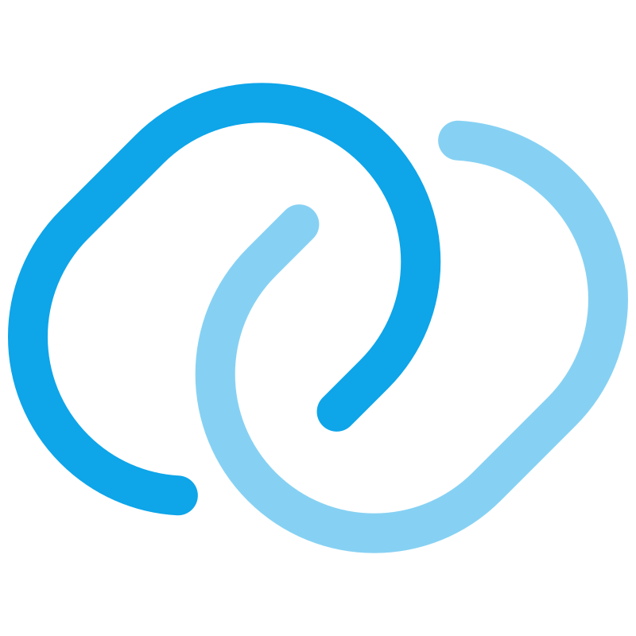

  

  

 

  

    👋 <b>Hi there! 我是 Fengyw</b>  
    我是一名热衷于构建现代化 Web 应用的学生开发者。 
    我喜欢将 <b>Object-Oriented Design (OOD)</b> 的思想融入代码，带来清晰高效的代码。 
    目前，我专注于<b>全栈开发和AI领域的学习</b>，闲暇时我也喜欢研究一些硬件相关的开发。 
    虽然很多技术仍在不断精进和探索中，但我非常享受每天都能掌握新技能、将理论知识落地成实际项目的过程！

  

  
  

 

  <h3>🛠 技术栈</h3>
  
  

    
    
    
    
    
    
     
    
    
    
    
     
    
    
    
    
    
     
    
    
    
    
    
  

 

  <h3>☎️ 联系方式</h3>
  
  &nbsp;&nbsp;&nbsp;&nbsp;&nbsp;&nbsp;
  
  
  &nbsp;&nbsp;&nbsp;&nbsp;&nbsp;&nbsp;
  
  

 